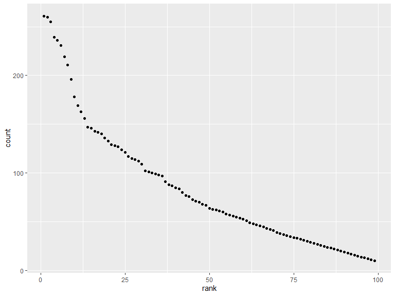

p8105\_hw2\_ha2546
================
Hana Akbarnejad
10/04/2019

# Problem 1

## Part 1

In this problem, we work with *Mr. Trash Wheel* data. In the first part
of this problem, I tidied the *Trash Wheel* sheet of this data, and
removed columns without values and rows with NA’s. Then I rounded the
number of sports balls and converted the result to an integer variable.

``` r
trash_data = 
  read_excel("data/Trash-Wheel-Collection-Totals-8-6-19.xlsx", sheet = "Mr. Trash Wheel") %>% 
  janitor::clean_names() %>% 
  select(-x15) %>% 
  drop_na(dumpster) %>% 
  mutate(
    sports_balls = round(sports_balls),
    as.integer(sports_balls)
  )
```

    ## New names:
    ## * `` -> ...15
    ## * `` -> ...16
    ## * `` -> ...17

## Part 2

In this part, I cleaned the precipitation data from 2017 and 2018. I
omitted rows without precipitation data and also added year columns to
these datasets. Then I stacked these datasets on top of each other to
create a single *prcpt\_data*, and converted *month* to a character
variable (English abbreviation).

``` r
prcpt2017_data = 
  read_excel("data/Trash-Wheel-Collection-Totals-8-6-19.xlsx", sheet = "2017 Precipitation", skip = 1) %>% 
  janitor::clean_names() %>% 
  drop_na() %>% 
  mutate(
    year = "2017"
  )

prcpt2018_data = 
  read_excel("data/Trash-Wheel-Collection-Totals-8-6-19.xlsx", sheet = "2018 Precipitation", skip = 1) %>% 
  janitor::clean_names() %>% 
  drop_na() %>% 
  mutate(
    year = "2018"
  )

prcpt_data =
  bind_rows(prcpt2017_data, prcpt2018_data) %>%
  mutate(
    month = month.abb[month]
  )
```

In Mr. Trash Wheel data, we have 344 observations, and 17 of variables
such as *dumpster*, *weight* and *volume* of trash for each dumpster,
and the number of *plastic bottles*, *cigarette butts*, etc. In
resulting precipitation dataset which we obtained from combining
precipitation data of 2017 and 2018, we have 24 total precipitation
observations of variables *month*, *year*, and *total* precipitation.
According to this dataset, the total precipitation in 2018 is 70.33
inches and the median number of sports balls in a dumpster in 2017 is 8.

# Problem 2

## Part 1

Problem two was dealing with *FiveThirtyEight* data which was composed
of different .csv files. First, I started cleaning the data in
*pols\_month.csv* file by cleaning the names and seperating date
variable( *mon* ) into *year*, *month*, and *day* variables and then
converted them to integers. I then transformed month’s format to English
abbreviation format. On the next step, I made a new column named
*president* which will include information from *prez\_gop* and
*prez\_dem* columns, I just recoded the information in *prez\_gop*
column and removed these two columns, as well as the variable *day* that
was mentioned in the problem.

Note: I observed two “2” values in *prez\_gop* while the values in this
column should be either either “0” or “1”. So I just assumed these
values are supposed to be “1” and before recoding to the president
column, I replaced them with “1”.

``` r
pols_month_data = read_csv("data/pols-month.csv") %>% 
  janitor::clean_names() %>%
  separate(mon, into = c("year", "month", "day"), convert = TRUE) %>% 
  mutate(
    month = month.abb[(month)],
    prez_gop = replace(prez_gop, prez_gop == "2", "1"),
    president = recode(prez_gop, "1" = "gop" , "0" = "dem"),
  ) %>% 
   select(year, month, president, everything(), -starts_with("prez"), -day)
```

    ## Parsed with column specification:
    ## cols(
    ##   mon = col_date(format = ""),
    ##   prez_gop = col_double(),
    ##   gov_gop = col_double(),
    ##   sen_gop = col_double(),
    ##   rep_gop = col_double(),
    ##   prez_dem = col_double(),
    ##   gov_dem = col_double(),
    ##   sen_dem = col_double(),
    ##   rep_dem = col_double()
    ## )

## Part 2

Second, I cleaned the *snp.csv*. The process for cleaning this part is
very similar to part 1, the only thing different was that because of how
the data is structured, I also had to alter *year* and *month*
variables’ order and arrange them as my leading variables. I did not
select *day* variable in this part as well because of consistency with
previous part. Then I turned *month* from numeric format to English
abbreviation format.

``` r
snp_data = read_csv("data/snp.csv") %>% 
  janitor::clean_names() %>% 
  separate(date, into = c("month", "day", "year"), convert = TRUE) %>%
  select(year, month, close) %>% 
  mutate(
    month = month.abb[(month)]
  )
```

    ## Parsed with column specification:
    ## cols(
    ##   date = col_character(),
    ##   close = col_double()
    ## )

## Part 3

In the third part, I tidied up the *unemplyment\_data*. This dataset is
composed of 1 column for year, and 12 columns for different months of a
year. To tidy this dataset, I had to transform it from wide format to
long format, using unemployment rates as my values and created a new
variable *month* instead of having each month as a variable. I then
cleaned the names of my columns using janitor. Deoing so makes the
dataset consitent with previous datasets and this will enable us to join
them on the next step.

``` r
unemployment_data = read_csv("data/unemployment.csv") %>% 
  pivot_longer(
    Jan:Dec,
    names_to = "month",
    values_to = "unemp_prcnt"
  ) %>% 
    janitor::clean_names()            
```

    ## Parsed with column specification:
    ## cols(
    ##   Year = col_double(),
    ##   Jan = col_double(),
    ##   Feb = col_double(),
    ##   Mar = col_double(),
    ##   Apr = col_double(),
    ##   May = col_double(),
    ##   Jun = col_double(),
    ##   Jul = col_double(),
    ##   Aug = col_double(),
    ##   Sep = col_double(),
    ##   Oct = col_double(),
    ##   Nov = col_double(),
    ##   Dec = col_double()
    ## )

## Part 4

On the final step for this problem, I first left-joined the *snp\_data*
to *pols\_month\_data*, using keys *year* and *month*, and then
left-joined the *unemployment\_data* to the
result.

``` r
join_pols_snp_unemp = left_join(pols_month_data, snp_data, by = c("year", "month")) %>% 
  left_join(unemployment_data, by = c("year", "month")) 
```

## Results

In problem 2, we were dealing with *pols\_month*, *snp*, and
*unemployment* datasets of the *FiveThirtyEight* data.

After tidying these datasets, *pols\_month* dataset’s dimension is 822,
9 which means it has 9 variables including *year* and *month*,
*president* which shows whether the president was republican or
democrat, and the number of governors ( *gov* ), the number of senators
( *sen* ), and the number of representatives ( *rep* ) for both
republican and democratic parties on associated dates. The dataset
contains 822 observations for these variables, and the range of years
investigated is 68 years (between 1947, 2015).

The dimension of the resulting dataframe *snp\_data* is 787, 3 which
means it has 787 observations of 3variables including *year*, *month*,
and *close* (the closing values of the S\&P stock index). The data
recorded in this dataset is associated with 65 years (between years
1950, 2015).

After cleaning up, the resulting *unemployment* dataset is a 816, 3
dimension dataset: 816 observations of 3 variables including *year*,
*month*, and another variable called *unemp\_prcnt* which shows
unemployement percentage associated with these dates. The range of years
for these data equals: 2015-1948 = 67 years.

# Problem 3

## Part 1

This problem deals with *Popular Baby Names* dataset. In the first part,
I cleaned the data by addressing some problems it had: some names were
title case and some were upper case, I converted all to title case.
Also, in the *ethnicity variable* some ethnicities were coded with two
different titles, I recoded them and made them uniform. I also title
cased ethnicity and lower cased gender just because I thought it is more
readable and nice. Finally, I chose the distinct rows as there were some
repetitives.

``` r
pop_names_data = read_csv("data/Popular_Baby_Names.csv") %>% 
  janitor::clean_names() %>% 
  mutate(
    childs_first_name = str_to_title(childs_first_name),
    gender = str_to_lower(gender),
    ethnicity = recode(ethnicity, "ASIAN AND PACI" = "ASIAN AND PACIFIC ISLANDER", "WHITE NON HISP" = "WHITE NON HISPANIC", "BLACK NON HISP" = "BLACK NON HISPANIC")
  ) %>% 
  mutate(
    ethnicity = str_to_title(ethnicity)               
  ) %>% distinct()
```

    ## Parsed with column specification:
    ## cols(
    ##   `Year of Birth` = col_double(),
    ##   Gender = col_character(),
    ##   Ethnicity = col_character(),
    ##   `Child's First Name` = col_character(),
    ##   Count = col_double(),
    ##   Rank = col_double()
    ## )

## Part 2

In this part, I created a table which shows how the rank of the female
name “Olivia” has changed over time in different ethnicity groups.The
rows of this table are the four ethnicity groups, the columns are years,
and the values are the ranks of the name
“Olivia”.

``` r
olivia_pop = filter(pop_names_data, childs_first_name == "Olivia" & gender == "female") %>% 
  select(year_of_birth, ethnicity, rank) %>% 
pivot_wider(
  names_from = "year_of_birth", 
  values_from = "rank") %>% 
  knitr::kable()

olivia_pop
```

| ethnicity                  | 2016 | 2015 | 2014 | 2013 | 2012 | 2011 |
| :------------------------- | ---: | ---: | ---: | ---: | ---: | ---: |
| Asian And Pacific Islander |    1 |    1 |    1 |    3 |    3 |    4 |
| Black Non Hispanic         |    8 |    4 |    8 |    6 |    8 |   10 |
| Hispanic                   |   13 |   16 |   16 |   22 |   22 |   18 |
| White Non Hispanic         |    1 |    1 |    1 |    1 |    4 |    2 |

## Part 3

In this part, I created another table for the most popular male names
over time in different ethnicity groups. The rows are ethnicity groups
and the columns are years. the cells of the table includes the names.

``` r
male_pop = filter(pop_names_data, gender == "male" & rank == "1") %>% 
    select(year_of_birth, ethnicity, childs_first_name) %>% 
pivot_wider(
  names_from = "year_of_birth", 
  values_from = "childs_first_name") %>% 
  knitr::kable()

male_pop
```

| ethnicity                  | 2016   | 2015   | 2014   | 2013   | 2012   | 2011    |
| :------------------------- | :----- | :----- | :----- | :----- | :----- | :------ |
| Asian And Pacific Islander | Ethan  | Jayden | Jayden | Jayden | Ryan   | Ethan   |
| Black Non Hispanic         | Noah   | Noah   | Ethan  | Ethan  | Jayden | Jayden  |
| Hispanic                   | Liam   | Liam   | Liam   | Jayden | Jayden | Jayden  |
| White Non Hispanic         | Joseph | David  | Joseph | David  | Joseph | Michael |

## Part 4

Finally, I created a scatterplot for white non hispanic boys who were
born in 2016 and. In this scatterplot we can observe that as we expect,
as the rank value becomes bigger, the count becomes smaller which simply
shows decrease in the popularity of those names.

``` r
pop_scatterplot = pop_names_data %>% 
  filter(gender == "male" & ethnicity == "White Non Hispanic" & year_of_birth == "2016") %>% 
  ggplot(aes(x = rank, y = count)) + geom_point()

pop_scatterplot
```


